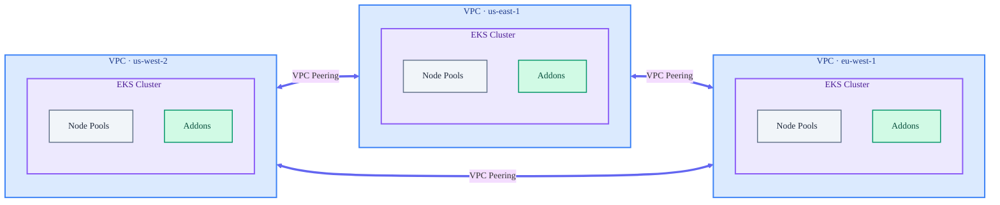

# Multi-Region Project

This folder contains a Pulumi project that uses `pulumi_eks_ml` to create a multi-region EKS architecture:

-   A **Global Network** connecting multiple regions.
    -   Implements a **Full Mesh** topology via VPC peering.
    -   Handles cross-region DNS resolution for seamless service discovery.
-   An **EKS cluster** in each region.
-   **Recommended addons** installed on every cluster.

Use this as a reference for deploying global or multi-region AI/ML platforms where all regions need direct connectivity to each other.

## Architecture



## How it works

The program in `__main__.py`:

1.  Reads the list of target regions from `regions` configuration.
2.  Creates a multi-region VPC group using `vpc.VPCPeeredGroup`.
    -   Configures a **Full Mesh** topology where every region peers with every other region.
    -   Configures route tables and cross-region DNS resolution.
3.  Iterates through all configured regions to deploy EKS clusters.
4.  Installs recommended addons (like Karpenter, Metrics Server, etc.) on each cluster.

## Configuration

Update `Pulumi.dev.yaml` (or your stack file) with these keys:

-   `regions`: List of AWS regions to deploy into.
-   `node_pools`: Array of node pool configurations applied to *all* clusters.
-   `versions`: (Optional) Versions for Kubernetes, addons, etc.

**Note:** You do not need to set `aws:region` as the program explicitly manages providers for each configured region.

### Example `Pulumi.dev.yaml`

```yaml
config:
  # List of regions to deploy to
  regions:
    - us-west-2
    - us-east-1
    - eu-west-1
  
  # Node pools (applied to every cluster)
  node_pools:
    - name: system
      capacity_type: on-demand
      instance_category: ["t"]
      ebs_size: "50Gi"
    - name: gpu-workers
      capacity_type: spot
      instance_category: ["g"]
```

## Run it

### Secret management

Before running the stack, configure a secrets provider (passphrase or a cloud KMS).

```bash
# Initialize stack (if not already done)
pulumi stack init dev
```

### Deploy

```bash
# Install dependencies
uv sync

# Select stack
pulumi stack select dev

# Deploy
uv run pulumi up
```

## Outputs

After deployment, the stack will export:

-   `clusters`: A map of region names to cluster details, including:
    -   `vpc_id`: The ID of the VPC in that region.
    -   `cluster_name`: The name of the EKS cluster.

## Files

-   `__main__.py`: Main Pulumi program defining the multi-region infrastructure.
-   `Pulumi.yaml`: Project metadata.
-   `Pulumi.dev.yaml`: Example stack configuration.
