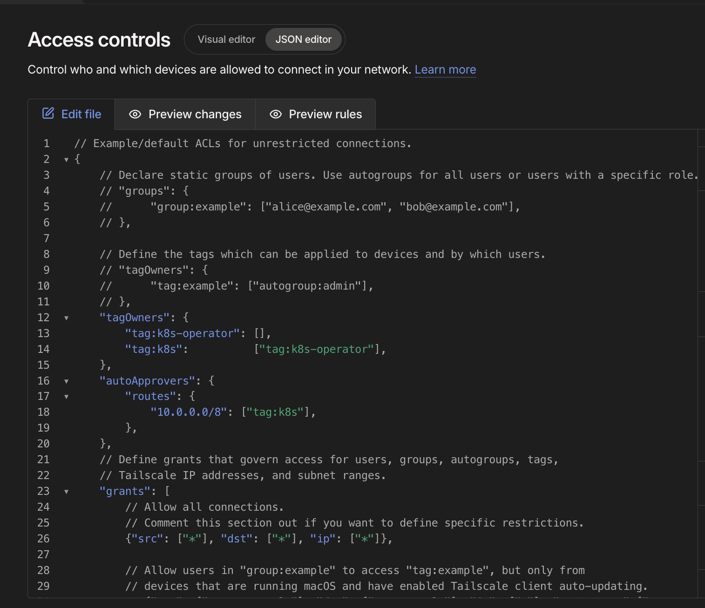
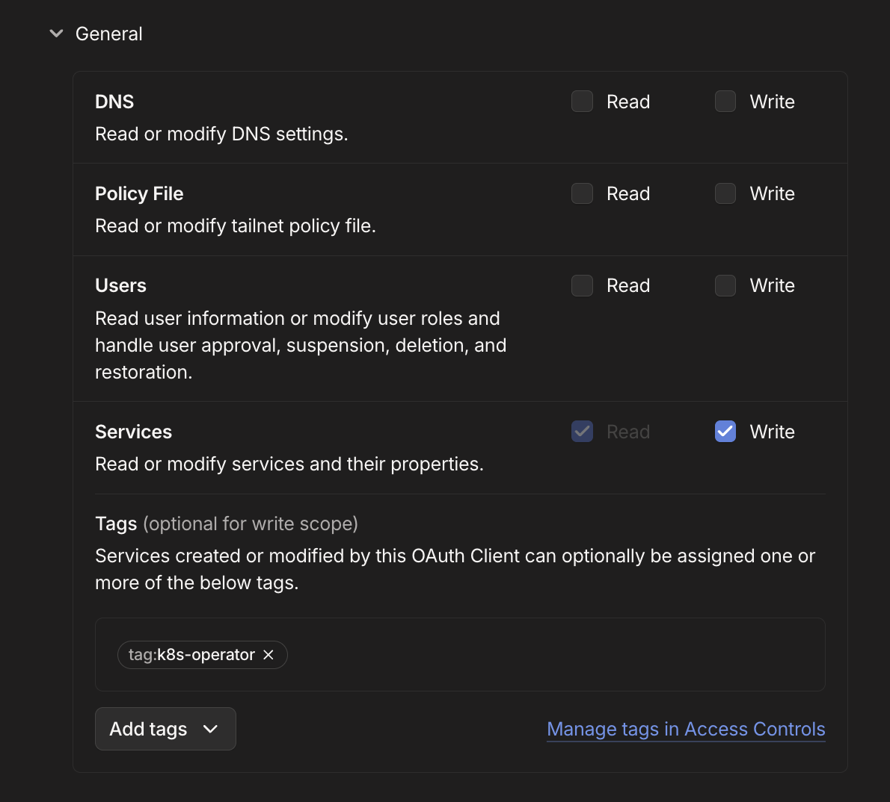
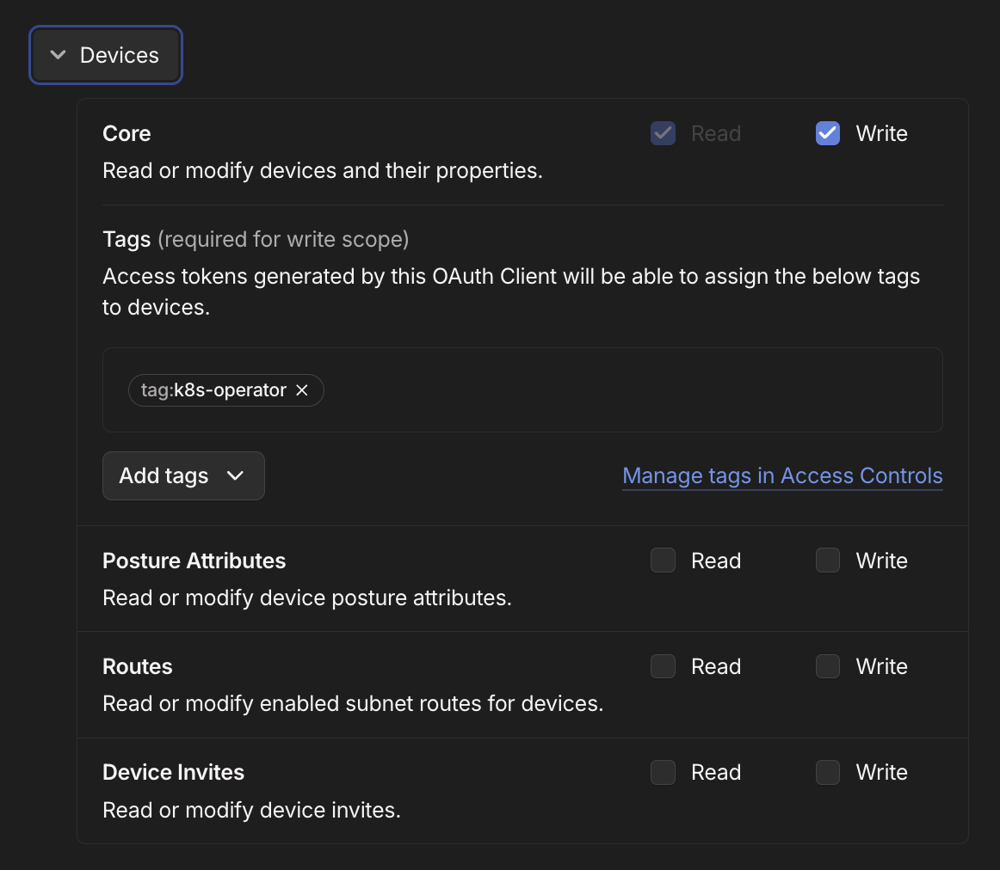
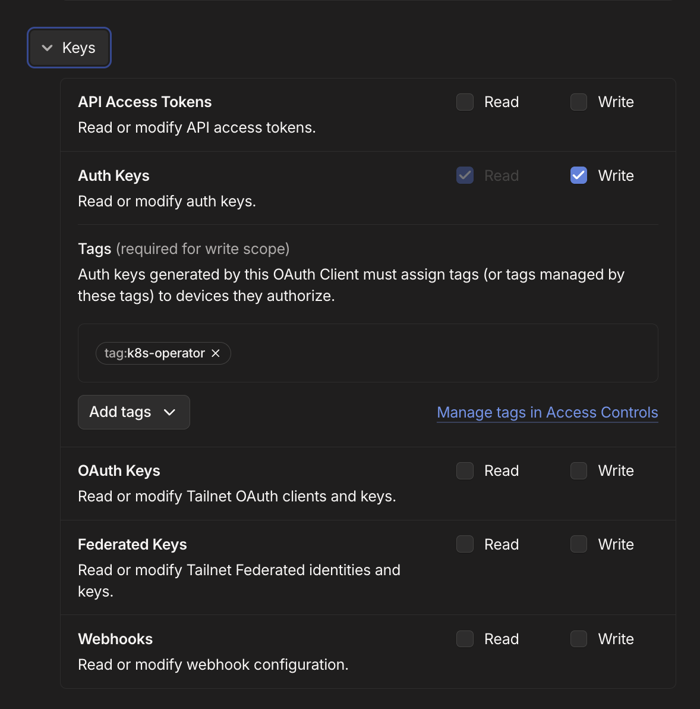
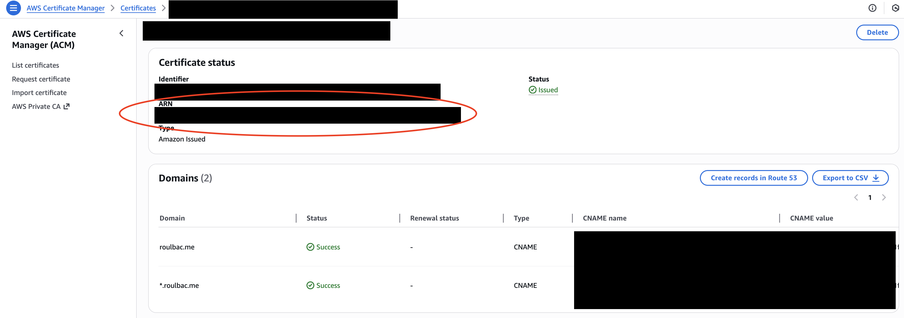
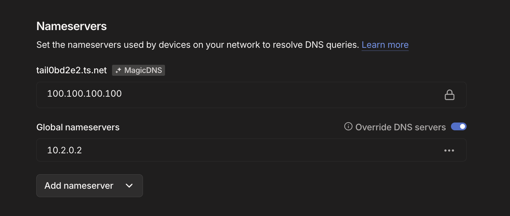
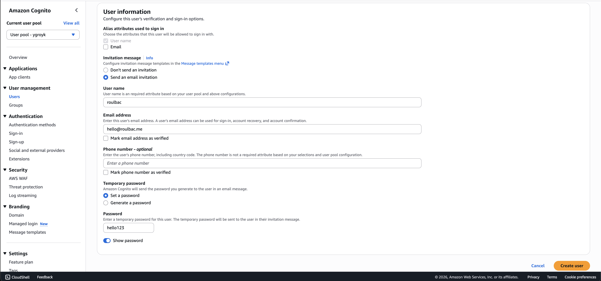

# Deployment Guide

This guide details the steps to deploy the SkyPilot multi-tenant architecture.

## Prerequisites

### 1. Tailscale Setup

This architecture relies on Tailscale for secure, private access to the infrastructure.

1.  **Create a Tailscale Account**: If you don't have one, sign up at [tailscale.com](https://tailscale.com).
2.  **Update ACL Policy**:
    *   Go to the **Access Controls** section in the Tailscale Admin Console.
    *   Add the following snippet to your policy file. This configures auto-approval for the Kubernetes operator and defines the tag hierarchy.

    ```json
    "tagOwners": {
        "tag:k8s-operator": [],
        "tag:k8s":          ["tag:k8s-operator"],
    },
    "autoApprovers": {
        "routes": {
            "10.0.0.0/8": ["tag:k8s"],
        },
    },
    ```

    

3.  **Create OAuth Client**:
    *   Follow the [Tailscale Documentation](https://tailscale.com/docs/features/kubernetes-operator#prerequisites) to create an OAuth client.
    *   Ensure it has the `Devices` (Core), `Auth Keys`, and `Services` scopes (Write).
        
        
        
        
        
    *   **Save the Client Secret** for the next step.
    *   **Create AWS Secret**:
        *   Go to **AWS Secrets Manager** in the Hub Region.
        *   Create a new secret (Other type of secret).
        *   Add two key/value pairs:
            *   `CLIENT_ID`: Your Tailscale OAuth Client ID.
            *   `CLIENT_SECRET`: Your Tailscale OAuth Client Secret.
        *   Name the secret (e.g., `skypilot-tailscale-oauth`) and save the **ARN**.

### 2. Domain & SSL Certificate

You need a public domain name (e.g., `skypilot.example.com`) to access the SkyPilot API.

1.  **Public Domain**: Ensure you own a domain name.
2.  **ACM Certificate**:
    *   Request or import a public certificate in **AWS Certificate Manager (ACM)** in the **Hub Region** (e.g., `us-west-2`).
    *   This certificate must cover the hostname you intend to use (e.g., `*.example.com` or `skypilot.example.com`).

    

**Note**: Even though you are using a public domain name and certificate, the DNS records created by this stack are hosted in a **Private Route53 Hosted Zone**. The endpoint will **not** be publicly accessible over the internet. You will only be able to resolve and access it when connected to your Tailscale network.

### 3. Tooling

Ensure you have the following installed:

*   [`uv`](https://github.com/astral-sh/uv) (for Python dependency management)
*   [`pulumi`](https://www.pulumi.com/docs/install/)
*   AWS CLI configured with appropriate credentials.

---

## Configuration

1.  Initialize your stack (if starting fresh):
    ```bash
    pulumi stack init dev
    ```

2.  Configure `Pulumi.dev.yaml`. Ensure the following keys are set:

    *   `hub.skypilot.ingress_host`: The domain name for the SkyPilot API (e.g., `skypilot.my-domain.com`).
        *   **Important**: Ensure your ACM certificate covers this domain. If you use a subdomain for the API server (e.g., `api.example.com`), the certificate must list that specific subdomain or use a wildcard (e.g., `*.example.com`).
    *   `hub.skypilot.ingress_ssl_cert_arn`: The ARN of the ACM certificate created in the prerequisites.
    *   `hub.tailscale.oauth_secret_arn`: The ARN of the Secrets Manager secret containing your Tailscale OAuth client secret.
        *   *Note: While you can provide the secret directly or use Pulumi config secrets, using an ARN reference to Secrets Manager is recommended for security.*

    Example structure:
    ```yaml
    config:
      hub:
        region: us-west-2
        tailscale:
          oauth_secret_arn: "arn:aws:secretsmanager:us-west-2:123456789012:secret:tailscale-oauth-..."
        skypilot:
          ingress_host: "skypilot.example.com"
          ingress_ssl_cert_arn: "arn:aws:acm:us-west-2:123456789012:certificate/..."
        # ... other config
    ```

---

## Deployment

1.  Install dependencies:
    ```bash
    uv sync
    ```

2.  Deploy the infrastructure:
    ```bash
    uv run pulumi up
    ```

    Review the plan and select `yes` to deploy.

---

## Post-Deployment

### 1. Tailscale DNS Configuration

To resolve the private `ingress_host` domain, you must configure Tailscale to use the Hub VPC's DNS server.

1.  **Get the Hub VPC CIDR**:
    Look at the stack output `hub_vpc_cidr` after deployment.
    *   Example: `10.0.0.0/16`

2.  **Calculate DNS Server IP**:
    The AWS VPC DNS server is always the **base IP + 2**.
    *   If CIDR is `10.0.0.0/16`, DNS IP is `10.0.0.2`.
    *   If CIDR is `10.100.0.0/16`, DNS IP is `10.100.0.2`.

3.  **Update Tailscale Global Nameservers**:
    *   Go to the **DNS** section in the Tailscale Admin Console.
    *   Under **Global Nameservers**, click **Add nameserver** -> **Custom**.
    *   Enter the calculated IP (e.g., `10.0.0.2`).
    *   **Important**: Enable **"Override DNS servers"** (Split DNS or strict override depending on your preference, but usually "Override Local DNS" ensures this private server handles the requests).

    

### 2. User Setup (Cognito)

The deployment creates a Cognito User Pool for authentication.

1.  Go to the AWS Console -> **Amazon Cognito**.
2.  Find the User Pool created by the stack.
3.  **Create a User**:
    *   Manually create a user for yourself (email/password).
    *   *Alternatively*: Configure a Federated Identity Provider (Google, SAML, etc.) if you prefer not to manage users directly in Cognito.

    
4.  **Log in**: Access the SkyPilot dashboard URL (e.g., `https://skypilot.example.com`) and log in with the user created above. This initializes your account record. You will notice that you start off with the "user" privilege level. To grant yourself admin privileges, you need to port-forward to the API server and grant the admin role, see below.

### 3. Admin Privilege Escalation

By default, new users have the "user" role. To become a SkyPilot Admin:

1.  **Port-Forward**: You need local access to the API server to bypass standard auth checks or access the admin interface directly.
    *   Find the API Server pod in the Hub cluster.
    *   Run:
        ```bash
        kubectl -n <SKYPILOT_NAMESPACE> port-forward pod/<SKYPILOT_POD_NAME> 46580:46580
        ```
2.  **Access Local Dashboard**:
    *   Open `http://127.0.0.1:46580/dashboard` in your browser.
3.  **Grant Admin**:
    *   In this local session, navigate to the Users management section.
    *   Find your user and grant the **Admin** role.