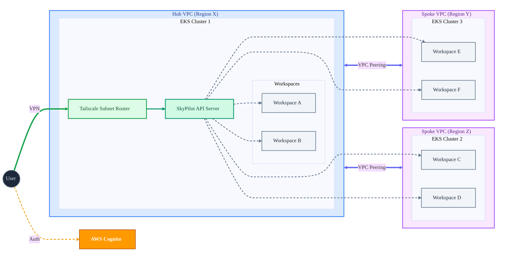

# SkyPilot Multi-Tenant Project

This folder contains a Pulumi project that uses `pulumi_eks_ml` to create a multi-region, multi-tenant SkyPilot architecture.

It deploys:
- A **Global Network** with Hub-and-Spoke topology.
- **EKS Clusters** in a Hub region and multiple Spoke regions.
- **SkyPilot API Server** hosted in the Hub cluster.
- **SkyPilot Data Planes** (namespaces) provisioned across Hub and Spoke clusters.
- **IAM Roles & Policies** for secure data plane access (IRSA).

Use this project to stand up a SkyPilot platform that serves multiple tenants/teams across different regions.

> **[See the Deployment Guide](./DEPLOYMENT.md) for step-by-step setup instructions.**

## Architecture

This solution creates a multi-region, private network for SkyPilot workloads.



## How it works

The program in `__main__.py`:

1.  **Networking**: Creates a global VPC group peered in a Hub-and-Spoke topology. This is designed so that all infrastructure is to be provisioned in **private subnets**, with **Tailscale** used as a VPN to provide secure access to the VPCs from the internet.
2.  **Clusters**: Deploys EKS clusters in the Hub and all Spoke regions with recommended addons (Karpenter, etc.).
3.  **SkyPilot Provisioning**:
    -   **API Server**: Deploys the SkyPilot API server in the Hub cluster.
    -   **Data Planes**: Creates namespaces and Service Accounts in specified clusters to act as SkyPilot execution environments.
    -   **User Identities**: Configures IRSA (IAM Roles for Service Accounts) for each data plane, allowing fine-grained permissions (e.g., S3 access) for different tenants.

## Configuration

Update `Pulumi.dev.yaml` (or your stack file) with the following structure:

-   `hub`: Configuration for the primary region.
    -   `region`: AWS region (e.g., `us-west-2`).
    -   `node_pools`: List of node pools for the cluster.
    -   `skypilot`:
        -   `data_planes`: List of data planes (tenants) to provision in this region. Each can optionally include a `user_role_arn`.
    -   `tailscale`: Tailscale configuration for secure VPC access.
-   `spokes`: List of spoke region configurations.
    -   `region`: AWS region.
    -   `node_pools`: Node pools for this region.
    -   `skypilot`:
        -   `data_planes`: List of data planes to provision here. Each can optionally include a `user_role_arn`.
  
**Notes:** 
- Pulumi may automatically preprend `sp:` to the keys in your stack's YAML file.
- No need to set `aws:region` as the program explicitly manages providers for each configured region.

### Example `Pulumi.dev.yaml`

```yaml
config:
  # Hub Region Configuration
  sp:hub:
    region: us-west-2
    node_pools:
      - name: system
        capacity_type: on-demand
        instance_type: [t3.medium]
        ebs_size: "50Gi"
      - name: gpu-workers
        capacity_type: spot
        instance_type: [g5.xlarge]
    # Define SkyPilot tenants/data planes for the Hub
    skypilot:
      ingress_host: skypilot.example.com
      ingress_ssl_cert_arn: arn:aws:acm:us-west-2:123456789012:certificate/uuid
      data_planes:
        - name: team-a-dev
          # Optional: Bring your own IAM role ARN
          # user_role_arn: arn:aws:iam::123456789012:role/TeamARole
        - name: team-b-prod

    # Tailscale Subnet Router
    tailscale:
      oauth_secret_arn: arn:aws:secretsmanager:us-west-2:123...

  # Spoke Regions Configuration
  sp:spokes:
    - region: us-east-1
      node_pools:
        - name: system
          capacity_type: on-demand
          instance_type: [t3.medium]
      skypilot:
        data_planes:
          - name: team-a-latency-sensitive

    - region: eu-west-1
      node_pools:
        - name: gpu-workers
          capacity_type: spot
          instance_type: [g5.2xlarge]
      skypilot:
        data_planes: [] # Just compute capacity, no specific tenant isolation required yet
```

## Run it

### Secret Management
Ensure you have a secrets provider configured (passphrase or cloud KMS).

```bash
# Initialize stack (if not already done)
pulumi stack init dev
```

### Deploy

```bash
# Install dependencies
uv sync

# Select stack
pulumi stack select dev

# Deploy
uv run pulumi up
```

## Outputs

After deployment, the stack will export:

-   `skypilot_api_service_config`: The endpoint URL and configuration for the SkyPilot API.
-   `skypilot_admin_username` / `password`: Credentials for the SkyPilot API.
-   `skypilot_ingress_status`: Status of the LoadBalancer/Ingress.
-   `clusters`: Details of provisioned EKS clusters.
-   `skypilot_data_planes`: Details of provisioned data planes and their IAM roles.
