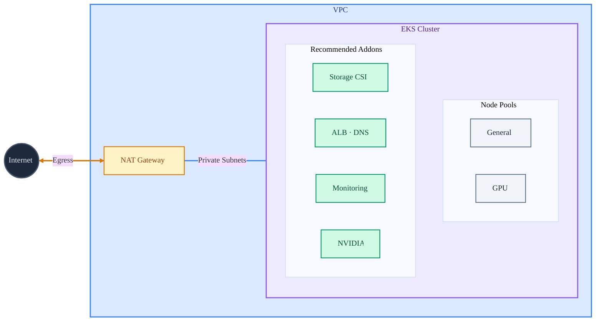

## Starter Project

This folder is a minimal Pulumi project that uses `pulumi_eks_ml` to create:

- A single VPC with private subnets and a minimal public subnet for internet egress
- A single EKS cluster
- Recommended addons (Storage CSI, ALB · DNS, Monitoring, NVIDIA, etc...)

Use it as a reference or a starting point for your own topology.

### Architecture



### How it works

The program in `__main__.py`:

- Reads the AWS region from `aws:region`
- Generates a deployment name from the project + stack
- Builds node pools from `node_pools` config

### Configuration

Update `Pulumi.dev.yaml` (or your stack file) with these keys:

- `aws:region` (required by the AWS provider)
- `node_pools` (array of node pool objects)

Each node pool uses an `instance_type` list and can optionally set
`instance_family` and `instance_category` lists. Example:

**Note**: Pulumi may automatically preprend `starter:` to the keys in your stack's YAML file.

```yaml
config:
  aws:region: us-west-2
  starter:node_pools:
    - name: general
      capacity_type: on-demand
      instance_category: [t]
    - name: gpu
      capacity_type: on-demand
      instance_category: [g]
```

### Run it

### Secret management

Before running the stack, configure a secrets provider (passphrase or a cloud KMS).
A `Pulumi.<stack>.yaml` file in the repo does not create the stack in the backend,
so if this is your first time running `dev`, you still need to initialize it.
This project does not include an `encryptionsalt` in `Pulumi.dev.yaml`, so Pulumi
will prompt you to set up secrets on first init/select.

Helper commands:

```bash
# Passphrase-based encryption (local backend)
export PULUMI_CONFIG_PASSPHRASE="your-strong-passphrase"
pulumi stack init dev

# Or initialize the stack with a cloud secrets provider (example: AWS KMS)
pulumi stack init dev --secrets-provider="awskms://alias/your-kms-key"
```

```bash
pulumi stack select dev
uv run pulumi up
```

### Files

- `__main__.py`: Pulumi program
- `Pulumi.yaml`: Project metadata
- `Pulumi.<stack>.yaml`: Stack configuration
